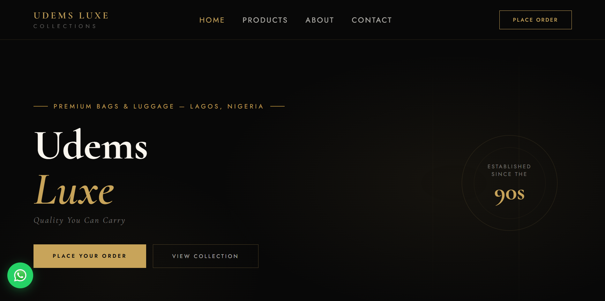

# 👟 Udems Luxe Collections

A modern, responsive e-commerce website built for **Udems Luxe Collections**, showcasing premium footwear with a clean user experience and mobile-first design.

Designed to provide customers with an elegant way to browse products and contact the business.

---

## 🌐 Live Demo

👉 https://www.udemsluxecollections.com/

---

## 📸 Preview



---

## ✨ Features

- 🎨 Modern and responsive user interface
- 📱 Mobile-first design
- 👟 Product showcase section
- 🖼️ Image gallery
- 📞 Contact and enquiry pages
- ⚡ Smooth navigation
- 🚀 Fast loading performance
- 🔍 SEO-friendly structure
- 🌍 Cross-browser compatibility

---

## 🛠️ Built With

- HTML5
- CSS3
- JavaScript
- Google Fonts

---

## 📂 Project Structure

```text
Udems-Luxe-Collections/
│
├── assets/
│   ├── images/
│   └── icons/
│
├── index.html
├── products.html
├── gallery.html
├── contact.html
├── enquiry.html
├── style.css
├── main.js
└── README.md
```

---

## 🎯 Project Goals

This project was developed to:

- Create a modern online presence for a footwear brand.
- Practice responsive web design.
- Improve UI/UX skills.
- Build a production-ready business website.

---

## 📱 Responsive Design

The website is fully responsive and optimized for:

- 💻 Desktop
- 💼 Laptop
- 📱 Mobile
- 📟 Tablet

---

## 🚀 Future Improvements

- 🛒 Shopping cart functionality
- 💳 Online payment integration
- 🔍 Product search
- ❤️ Wishlist feature
- 👤 User authentication
- 📦 Product filtering
- ⭐ Product reviews
- 🌙 Dark mode

---

## 👨‍💻 Author

**Ajagbe Gideon**

Information Technology Student • Web Developer • Building Practical AI & Web Solutions

🌐 Portfolio: https://gideon-ajagbe.vercel.app

💼 LinkedIn: https://linkedin.com/in/ajagbe-gideon

🐙 GitHub: https://github.com/ajabegideon

---

## ⭐ Support

If you found this project helpful, consider giving it a **⭐ Star** on GitHub.

It helps support my work and future projects.
